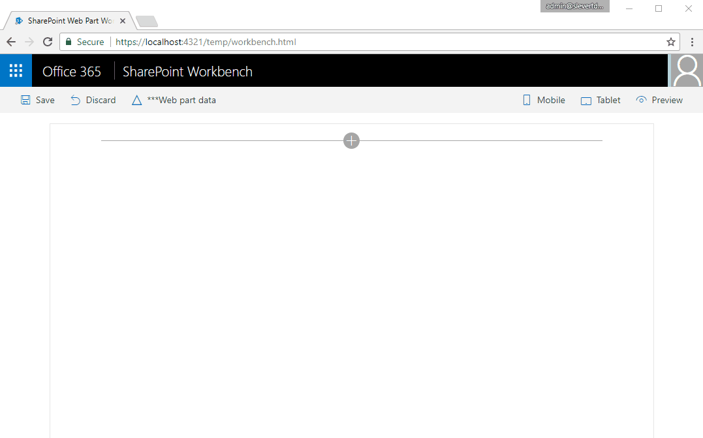
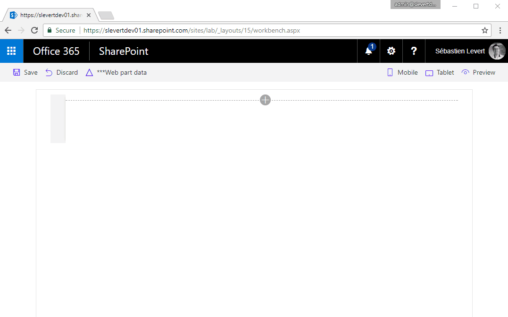

# SharePoint Framework Angular Boilerplate

## Summary
Simplistic sample Web Part that demonstrates the use of Angular in creating a SharePoint Framework web part. The properties pane for this web part allows to configure the title and the List Name of a list to display the content from.

> The webpart uses mocked data when the sample is run from the Local Workbench.

> The webpart live data when the sample is run from the Hosted Workbench.

## Used SharePoint Framework Version 

## Applies to

* [SharePoint Framework General Availability](http://dev.office.com/sharepoint/docs/spfx/sharepoint-framework-overview)
* [Office 365 developer tenant](http://dev.office.com/sharepoint/docs/spfx/set-up-your-developer-tenant)

## Solution

Solution|Author(s)
--------|---------
spfx-angular-boilerplate|Sébastien Levert (MVP, Valo Intranet, @sebastienlevert)

## Version history

Version|Date|Comments
-------|----|--------
1.0|July 31, 2017|Initial release

## Disclaimer
**THIS CODE IS PROVIDED *AS IS* WITHOUT WARRANTY OF ANY KIND, EITHER EXPRESS OR IMPLIED, INCLUDING ANY IMPLIED WARRANTIES OF FITNESS FOR A PARTICULAR PURPOSE, MERCHANTABILITY, OR NON-INFRINGEMENT.**

---

## Minimal Path to Awesome

- Clone this repository
- in the command line run:
  - `npm install`
  - `gulp serve`
  - `Open the *workbench* from your Localhost`
  - `Open the *workbench* on your Office 365 Developer tenant`

## Features
The spfx-angular-boilerplate web part displays the content of the list specified in the web part properties pane.

This Web Part illustrates the following concepts on top of the SharePoint Framework:

* Using Angular as the UI Framework
* Using multiple Angular webparts on the same page
* The use of PnP JS Core with async/await support in TypeScript

A blog series is available to go through all the details of this solution. Please see it here : [SharePoint Framework and Angular](https://www.sebastienlevert.com/2017/07/31/sharepoint-framework-and-angular-introducing-the-spfx-angular-boilerplate)